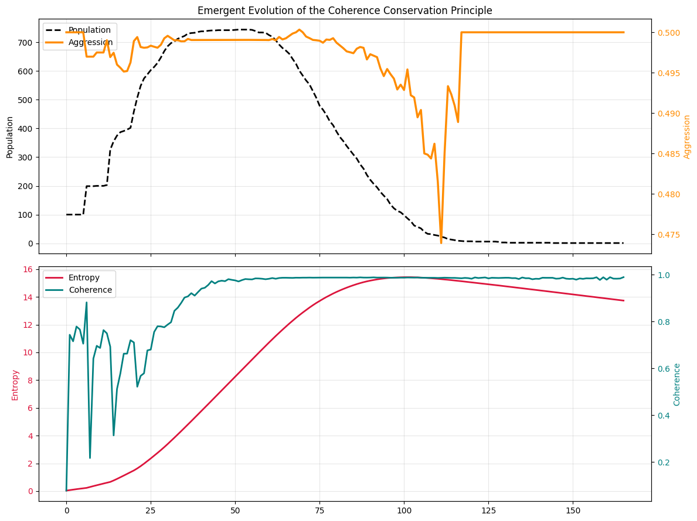

# coherence-conservation-simulation
An evolutionary agent-based simulation exploring the relationship between extraction, entropy, systemic coherence, and sustainability.  Features: - Evolutionary dynamics - Mutation systems - Environmental entropy - Predictive coherence metrics -Resource regeneration feedback loops- Multi-axis visualization  Built with Python, NumPy, and Matplotlib.
## Simulation Output

